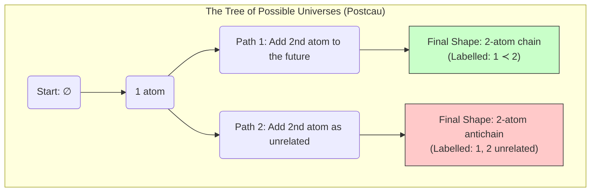
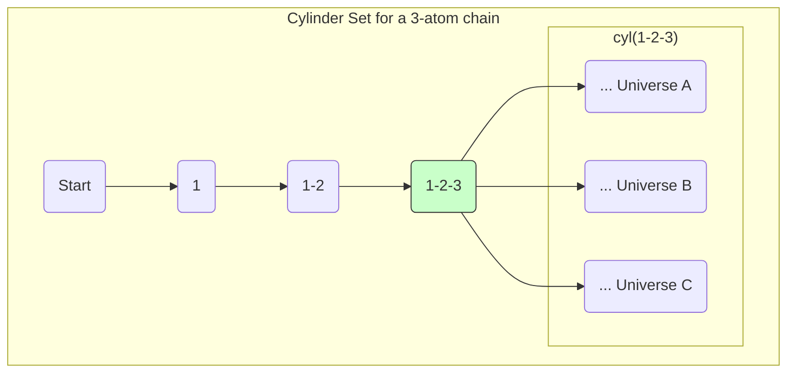

# Chapter 6: Dynamics: How Does the Universe Evolve?

## Introduction to Chapter 6: How Does the Universe Evolve?

So far, we have a static picture: a causal set `C` is a snapshot of a universe's structure. Chapter 6 asks the big question: **How does the universe *happen*?**

The answer proposed is that the universe isn't static; it **grows**. It starts from nothing (or a single atom) and evolves by adding new spacetime atoms one by one. This chapter explores the rules of this growth process, first in a classical (non-quantum) way, and then making the leap to a full quantum theory.

The two main approaches discussed are:
1.  **The "Bottom-Up" Approach (Sequential Growth):** Building the universe from first principles, one atom at a time.
2.  **The "Top-Down" Approach (Continuum-Inspired):** Taking all possible finished universes and using the action from Chapter 4 to see which ones are the most likely.

---

## Section 6.1: Classical Sequential Growth Models (CSG)

*   **The Core Idea:** We model the universe as a stochastic (random) process where it grows element by element. Think of it as a game of "Cosmic Lego" with specific rules.

*   **The Rules of the Game:**
    1.  **Causality is Respected:** When a new atom is added, it is always added to the future. It can be in the future of some existing atoms, or unrelated to all of them, but it can *never* be in the past. The past is fixed and cannot be changed.
    2.  **Covariance (Order of Birth Doesn't Matter):** This is a crucial physical principle. The fundamental laws shouldn't care about the *labels* we assign to the atoms or the specific order in which they were born. All that matters is the final, unlabeled structure of the causal set. If two different growth paths lead to the same final shape, the theory must treat them equally.

    ```mermaid
    graph TD
        subgraph Growth Paths
            A[Start: 1 atom] --> B(Path 1: Add 2nd atom as unrelated);
            A --> C(Path 2: Add 2nd atom to the future);
            B --> D{Final Shape: 2 unrelated atoms};
            C --> E{Final Shape: 2-atom chain};
        end
    ```
    *In this diagram, the dynamics is about the probability of taking Path 1 vs. Path 2.*

    3.  **Bell Causality (A Locality Principle):** The probability of a new atom attaching to a certain region of the universe should only depend on that region. It shouldn't be affected by some distant, causally disconnected "spectator" region. This ensures the growth rules are local in a causal sense.
   
    > **Note:** The fractals violate locality, as the probability of a new atom being added in one region can depend on the structure of a distant region. This is a key difference from the models discussed here. Because prob clone to compa also depends on current position.

   **The Math (Transitive Percolation):** The simplest model that follows these rules is called **transitive percolation**. It's controlled by a single number, the probability `q`. At each step, for each existing atom, the new atom decides:
    *   With probability `p = 1-q`, it becomes a **link** to the existing atom (it becomes its direct successor).
    *   With probability `q`, it does not.
    The final relationship is the "transitive closure" of all these link choices (if A is linked to B and B is linked to C, then A is related to C). This simple model, controlled by one knob `q`, can generate complex, universe-like structures.

***

## Section 6.1 In-Depth: Classical Sequential Growth Models (CSG)

This section introduces a completely new way of thinking about the causal set. Instead of starting with a finished, static universe, we imagine it **growing, one spacetime atom at a time.** This provides a "bottom-up" model for the dynamics of spacetime itself. We are essentially defining the rules for a game of "Cosmic Lego."

### The Core Idea: The Universe as a Stochastic Growth Process

The fundamental concept of a Classical Sequential Growth (CSG) model is that the universe evolves through a sequence of steps. At each step, a new element is "born" and added to the existing causal set, making it slightly larger. This is a **stochastic** process, meaning the rules are probabilistic—at each step, there's a certain probability for the new element to attach to the existing structure in different ways.

This process is governed by three fundamental physical principles, which are the "rules of the game."

### The Rules of the Game

#### 1. Causality is Respected

This is the most basic rule. The past is fixed and cannot be changed. When a new element is added, it is always added to the **future**. It can be causally related to some of the existing elements (i.e., be in their future), or it can be spacelike to all of them, but it can never be added to their past.

#### 2. Covariance (or Label Invariance)

This is a deep principle of physics. The fundamental laws of the universe should not depend on the arbitrary labels we use. In this context, it means the **order of birth doesn't matter, only the final shape does.**

*   **Analogy:** Imagine building a Lego model. You and a friend might use different instruction steps and add the bricks in a different order, but if you both end up with the exact same final model, the laws of Lego shouldn't care about the path you took to get there.
*   **For Causal Sets:** If there are multiple different growth paths that result in the same final, unlabeled causal set structure, a covariant theory must assign the same total probability to all of them.

This principle can be visualized with a "Tree of Universes," where different branches can merge if they lead to the same final structure.


Covariance means that if another sequence of choices also led to the shape of `E`, the dynamics must treat them equitably.

#### 3. Bell Causality

This is a principle of locality. The probability of a new element attaching to a specific set of "parent" elements should not be affected by distant "spectator" elements that are causally disconnected from the parents. This ensures the growth rules are local in a causal sense, not spooky.

### The Mathematical Framework

How do we turn these principles into a mathematical model? The dynamics are fully determined by an infinite set of **coupling constants**.

#### The Simplest Model: Transitive Percolation

The most intuitive CSG model is **transitive percolation**. It's governed by a single parameter, `p`, the probability of forming a **link** (a direct causal connection).

At each step `n+1`, for each of the `n` existing elements, the new element decides:
*   With probability `p`, it forms a link to the existing element.
*   With probability `q = 1-p`, it does not.

The final causal relations are the "transitive closure" of these random link choices (i.e., if A is linked to B and B is linked to C, the relation A ≺ C is automatically created). This simple, one-parameter model can already generate surprisingly complex and universe-like structures.

#### The General Case: Coupling Constants `t_n`

In the most general case, the dynamics are specified by an infinite sequence of fundamental coupling constants $t_0, t_1, t_2, \dots$. The constant $t_n$ can be thought of as the "intrinsic tendency" for a new element to be born as the $(n+1)^{th}$ member of a newly formed antichain.

These fundamental constants `t_n` are related to more intuitive probabilities, $q_k$, where $q_k$ is the probability that a `k`-element antichain *remains* an antichain when a new element is added.

**Equation (80): Connecting `t_k` and `q_k`**

This equation provides the mathematical relationship between the fundamental constants `t` and the probabilities `q`. It is an application of the principle of inclusion-exclusion.

$$ t_n = \sum_{k=0}^{n} (-1)^{n-k} \binom{n}{k} \frac{1}{q_k} $$

*   **$t_n$**: The fundamental coupling constant we want to find.
*   **$q_k$**: The probability that a `k`-element antichain remains an antichain after one growth step. This is a more physically accessible quantity.
*   **$\binom{n}{k}$**: The binomial coefficient, "n choose k," which counts the number of ways to choose `k` elements from a set of `n`.
*   **$(-1)^{n-k}$**: The alternating sign is characteristic of the inclusion-exclusion principle.

**Meaning:** This formula allows you to calculate the underlying, fundamental parameters `t_n` of your theory if you know the observable probabilities `q_k`.

### Renormalization and Cosmological Bounces

A theory with an infinite number of parameters (`t_n`) is problematic. The paper proposes a natural mechanism for the universe to "simplify itself" over time: **cosmological bounces**.

*   **A "Post":** A post is a special element in a causal set that acts as a bottleneck. It is a single element that is in the future of *every other element* in its past. It's the discrete equivalent of a "Big Crunch" followed by a "Big Bang."
*   **Renormalization:** When the universe passes through a post, the memory of the specific coupling constants from the previous epoch is "washed out" and a new, simpler set of effective couplings emerges for the next epoch.

**Equation (81): The Renormalization Transformation**

This equation describes how the coupling constants are transformed after a bounce. If the original constants were $\{t_k\}$, the new effective constants $\{\tilde{t}_n^{(r)}\}$ are given by:

$$ \tilde{t}_n^{(r)} = \sum_{k=0}^{n} \binom{r}{k} t_{n+k} $$

*   **$\tilde{t}_n^{(r)}$**: The new, effective coupling constant in the new epoch.
*   **$t_{n+k}$**: The coupling constants from the previous epoch.
*   **`r`**: A number related to the size of the universe before the bounce.
*   **$\binom{r}{k}$**: The binomial coefficient.

> **The Punchline:** The paper states that this transformation has a very powerful effect. No matter what complicated set of constants $\{t_k\}$ you start with, after a few bounces, the dynamics will be driven towards the simple, one-parameter **transitive percolation** model. This suggests that our universe, if it has undergone such bounces, should be described by a very simple set of dynamical laws, regardless of its initial conditions.
---

## Section 6.2: Observables as Beables (What Can We Actually Measure?)

*   **The Core Idea:** If the universe is a random growth process, a "history" is a single, complete, grown causal set. An **observable** (or "beable," a term for something fundamentally real) is a *question* we can ask about the history. For example: "What is the probability that the universe grew to have at least one black hole?"

*   **The Main Tool (The Cylinder Set):** To formalize this, we use the concept of a **cylinder set**. This is the most important idea in this section.
    *   Imagine you observe the first `n` atoms of the universe's growth, and you see a specific labeled structure, `c_n`.
    *   The **cylinder set**, `cyl(c_n)`, is the collection of **all possible infinite future universes** that start with that exact initial history `c_n`.
    *   **Analogy:** If the history of the universe is a book, `cyl("Chapter 1")` is the set of all possible books that start with that exact first chapter.
    *   The probability of a cylinder set, $\mu(\text{cyl}(c_n))$, is simply the probability that the universe started growing in that specific way.

*   **The Event Algebra:** The set of all cylinder sets and their combinations (unions, intersections) forms the **event algebra, `A`**. This is the complete set of all possible questions you can ask about the universe's history.

*   **The Covariance Problem:** This framework is built on *labeled* atoms (atom 1, atom 2, etc.). But we just said physics shouldn't depend on labels! So, a true physical observable must be **covariant**—it must be a question that gives the same answer no matter how you relabel the atoms. The set of all universes with a "post" (a single atom that is the future of the entire past) is a perfect example of a covariant observable.

## Section 6.2 In-Depth: Observables as Beables

This section addresses a crucial question: **If the universe is the result of a random growth process, what constitutes a "measurement" or an "observation"?** We need a rigorous way to define physical questions and their probabilities. The answer lies in the language of **measure theory**, and the central concept is the **cylinder set**.

### The Core Idea: Histories, Events, and Observables

*   **Sample Space ($\Omega_g$):** The first step is to define the set of all possible outcomes. In the Classical Sequential Growth (CSG) model, the outcome of the entire process is a single, complete, infinite causal set. The **sample space $\Omega_g$** is the collection of *all possible universes* that could be generated by the growth dynamics.

*   **Event:** An "event" is not a single point in spacetime, but a *subset* of the sample space. It's a collection of possible universes that share a specific property. For example, the event "The universe contains a black hole" is the set of all causal sets in $\Omega_g$ that have the structure of a black hole somewhere within them.

*   **Observable (or Beable):** An observable is a physically meaningful question you can ask about the universe. Formally, it's an event that we can assign a probability to. The term "beable" is used to emphasize that these are properties of reality itself, independent of any observer.

### The Main Tool: The Cylinder Set

The most fundamental way to define an event is by using a **cylinder set**. It's the building block for all other observables.

*   **Definition:** Imagine you are watching the universe grow. You observe the first `n` elements as they are born, and you see they form a specific **labeled** causal set, which we'll call `c_n`. The cylinder set, `cyl(c_n)`, is the set of **all possible infinite universes** in the sample space $\Omega_g$ that begin with that exact initial history `c_n`.

*   **Analogy:** Think of the history of the universe as an infinitely long word being written one letter at a time. If you observe the first three letters are "C-A-T," the cylinder set `cyl("CAT")` is the set of all possible infinite words that start with "CAT" (e.g., "CAT...", "CATASTROPHE...", "CATATONIC...", etc.).


*This diagram shows that the cylinder set is a bundle of all possible future evolutions that share a common past.*

*   **The Probability Measure:** We can assign a probability to each cylinder set. The probability of the cylinder set `cyl(c_n)`, denoted $\mu(\text{cyl}(c_n))$, is simply the probability that the first `n` steps of the growth process produced the specific labeled causet `c_n`. This probability is calculated by multiplying the transition probabilities at each step along the growth path.

### The Event Algebra `A` and its Limitations

The set of all cylinder sets, along with their finite unions, intersections, and differences, forms a mathematical structure called an **algebra of sets**, denoted by `A`. This is the collection of all questions that can be answered by looking at a **finite** number of growth steps.

*   **Example:** The question "Did the universe start with a 2-chain OR a 2-antichain?" corresponds to the event `cyl(2-chain) U cyl(2-antichain)`, which is in `A`.

*   **The Limitation:** The algebra `A` is not powerful enough to describe all interesting physical questions. Specifically, it cannot describe events that depend on the infinite future of the universe.
    *   **Example:** The event "The universe eventually forms a post" (a cosmological bounce) cannot be confirmed by looking at any finite number of steps. You have to look at the entire infinite history. Therefore, this event is **not** in the simple algebra `A`.

### The Solution: The Sigma-Algebra `S` and Covariant Observables

To ask questions about the infinite future, we must extend our collection of events `A` to a **sigma-algebra `S`**. A sigma-algebra is closed under *countable* (infinite) unions and intersections, making it powerful enough to describe events like the "post" event.

However, we have one final, crucial filter to apply: **Covariance**.

*   **The Problem:** The cylinder set framework is built on **labeled** causal sets (element 1, element 2, etc.). But as we established in Section 6.1, fundamental physics should not depend on these arbitrary labels.
*   **The Definition of a Covariant Observable:** A true physical observable must be a **covariant event**. A covariant event is a set of histories (an element of `S`) with a special property: if a particular labeled universe `c` is in the event, then *every possible relabeling* of `c` must also be in the event.

**Example:**
*   **Not Covariant:** The event "Element #5 is a link to element #8." This question depends on the specific labels "5" and "8." If we relabel the elements, the question becomes meaningless.
*   **Covariant:** The event "The universe contains at least one 4-element chain." This question is about the *structure* of the universe. It doesn't matter which four elements form the chain or what their labels are. If you find a universe in this set and relabel its elements, it will still contain a 4-element chain, so it remains in the set.

**The Punchline:** A true physical observable, or "beable," in Causal Set Theory is a **covariant measurable set**—a question that is independent of labels and can be assigned a well-defined probability by the dynamics. This provides a clear and rigorous definition of what we can, in principle, measure about our universe.

---

## Section 6.3: A Route to Quantisation: The Quantum Measure

*   **The Core Idea:** This section makes the giant leap from a classical, probabilistic growth process to a fully **quantum** one. In quantum mechanics, we don't just add probabilities; we add complex-numbered "amplitudes," which can interfere with each other (constructively or destructively).

*   **The Big Change (The Decoherence Functional):** We replace the classical probability measure $\mu(A)$ with a **Decoherence Functional**, $D(A, B)$.
    *   $D(A, B)$ is a complex number that measures the quantum interference between two sets of histories, `A` and `B`.
    *   The "quantum probability" of a single set of histories `A` happening is given by the diagonal element: $\mu_q(A) = D(A, A)$. This is a real, positive number.

*   **The Quantum Sum Rule:** Classical probability follows a simple rule: if A and B are mutually exclusive, $P(A \cup B) = P(A) + P(B)$. Quantum mechanics is weirder. The quantum measure $\mu_q$ obeys the **quantum sum rule**:
    $$ \mu_q(A \cup B \cup C) = \mu_q(A \cup B) + \mu_q(A \cup C) + \mu_q(B \cup C) - \mu_q(A) - \mu_q(B) - \mu_q(C) $$
    *(for three mutually exclusive sets of histories A, B, C)*
    This more complex rule is the mathematical signature of quantum interference. It accounts for the fact that the history "A or B" is not just the sum of A and B, because the paths leading to A can interfere with the paths leading to B.

*   **The Challenge:** This is a beautiful formal structure, but it is incredibly difficult to build a concrete decoherence functional `D` that satisfies all the rules of quantum theory *and* the principles of covariance and causality. The simplest toy model, **complex percolation**, where the probability `q` is allowed to be a complex number, shows just how hard this is.

## Section 6.3 In-Depth: A Route to Quantisation: The Quantum Measure

This section describes how to "quantize" the Classical Sequential Growth (CSG) model, turning it into a Quantum Sequential Growth (QSG) model. This is the heart of the quantum dynamics of Causal Set Theory. The key idea is to replace classical probabilities with quantum amplitudes, which allows for the defining feature of quantum mechanics: **interference**.

### The Core Idea: From Probabilities to Amplitudes

In the classical model (CSG), the evolution of the universe is like a game of dice. At each step, there's a real, positive probability for each possible outcome, and the total probability is always 1.

In the quantum model (QSG), the evolution is like a wave. Each possible path the universe can take is associated with a complex number called a **quantum amplitude**.
*   The **magnitude** of this number is related to the probability of that path.
*   The **phase** of this number is what allows different paths to interfere with each other. If two paths are in phase, they reinforce each other (constructive interference). If they are out of phase, they can cancel each other out (destructive interference).

This is the essence of Feynman's "sum over histories" approach to quantum mechanics, applied here to the history of the entire universe.

### The Main Tool: The Decoherence Functional

The classical probability measure `μ` is replaced by a more powerful object called the **Decoherence Functional**, denoted $D(\alpha, \beta)$.

*   **Definition:** The decoherence functional takes two *events* (two sets of histories, $\alpha$ and $\beta$) and assigns a complex number to them. This number, $D(\alpha, \beta)$, represents the **quantum interference** between the set of histories in $\alpha$ and the set of histories in $\beta$.

*   **Properties:** The decoherence functional must satisfy several key properties:
    1.  **Hermiticity:** $D(\alpha, \beta) = D(\beta, \alpha)^*$ (where $*$ denotes the complex conjugate). This ensures that the "probabilities" we derive are real numbers.
    2.  **Bi-additivity:** It is additive in both of its arguments. For example, $D(\alpha_1 \cup \alpha_2, \beta) = D(\alpha_1, \beta) + D(\alpha_2, \beta)$.
    3.  **Normalization:** $D(\Omega, \Omega) = 1$. The probability of the entire sample space (the set of all possible universes) is 1.
    4.  **Strong Positivity:** This is a technical condition that ensures the framework is physically consistent and doesn't produce negative probabilities.

### The Quantum Measure `μ`

From the decoherence functional, we can define the **quantum measure `μ`**. This is the quantum equivalent of probability.

**Equation (83): Defining the Quantum Measure**

The quantum measure of a single event $\alpha$ is defined as the diagonal element of the decoherence functional:

$$ \mu(\alpha) = D(\alpha, \alpha) $$

*   **$\mu(\alpha)$**: The quantum measure of the event $\alpha$. It's a real, positive number that plays the role of probability.
*   **$D(\alpha, \alpha)$**: The interference of the set of histories $\alpha$ *with itself*.

**Crucially, the quantum measure `μ` is NOT additive.** In general, for two disjoint events $\alpha$ and $\beta$:
$$ \mu(\alpha \cup \beta) \neq \mu(\alpha) + \mu(\beta) $$
This non-additivity is the direct mathematical consequence of quantum interference. The "probability" of (A or B) is not just the sum of the probabilities of A and B, because the histories leading to A can interfere with the histories leading to B.

### The Quantum Sum Rule

The failure of simple additivity is replaced by a more general rule, the **Quantum Sum Rule** (or "tri-additivity"). For three mutually disjoint events $\alpha, \beta, \gamma$, the quantum measure obeys:

$$ \mu(\alpha \cup \beta \cup \gamma) = \mu(\alpha \cup \beta) + \mu(\alpha \cup \gamma) + \mu(\beta \cup \gamma) - \mu(\alpha) - \mu(\beta) - \mu(\gamma) $$

*   **Meaning:** This rule precisely quantifies the interference effects. The measure of the union of three sets depends on the measures of the pairwise unions (which contain the two-way interference terms) and the measures of the individual sets. This is the fundamental law governing "quantum probability" in a histories-based framework.

### The Challenge: Building a Concrete Quantum Model

This is a beautiful and complete formal structure for a quantum theory of cosmology. However, constructing a specific, concrete decoherence functional `D` that satisfies all the physical requirements (like covariance and Bell causality) is extremely difficult.

*   **Complex Percolation:** The simplest attempt is to take the "transitive percolation" model from Section 6.1 and simply allow the probability `p` to be a complex number. This is called **complex percolation**.
*   **The Extension Problem:** The paper notes a deep mathematical problem with this simple model. While you can define the quantum measure `μ` on the simple algebra `A` (events defined by a finite number of steps), there is no guarantee that it can be consistently extended to the full sigma-algebra `S` (which includes questions about the infinite future). In fact, it was shown that for the simple complex percolation model, this extension is **not possible**.

> **The Punchline:** This is a major open problem in the field. The search is on to find a more sophisticated quantum dynamics (a more complex `D` functional) that is mathematically consistent and allows for the extension to the full set of physical observables. Finding such a model is one of the primary goals of the Causal Set Theory research program. It would represent a complete, self-contained, "first principles" theory of quantum gravity.
---

## Section 6.4: A Continuum-Inspired Dynamics

*   **The Core Idea:** The "bottom-up" quantum growth model is very hard. This section explores a more pragmatic, "top-down" approach. Instead of trying to grow the universe, let's look at the space of all possible *finished* universes and use the physics we already developed in Chapter 4 to pick the most likely one.

*   **The Main Tool (The Path Integral / Path Sum):** This is the quantum mechanical "sum over histories." The central object is the **partition function, `Z`**:
    $$ Z = \sum_{c \in \Omega} e^{i S(c) / \hbar} $$
    Let's break this down:
    *   $\sum_{c \in \Omega}$: This is a sum over every single possible causal set `c` in our sample space $\Omega$ (e.g., all causal sets with N atoms).
    *   $S(c)$: This is the **action** for the causal set `c`. We use the **Benincasa-Dowker (BD) action** from Chapter 4, which is the discrete version of Einstein's action for gravity. It acts as a "score" for how physically realistic a universe is.
    *   $e^{iS(c)/\hbar}$: This is the quantum **amplitude** or "weight" for that universe. Universes with actions that are stationary (an extremum) contribute the most.

*   **The Solution (Wick Rotation and MCMC):**
    1.  The `i` in the exponent makes the sum oscillate wildly and impossible to compute. We use a mathematical trick called **Wick Rotation**. We replace `i` with a real parameter `β`: $i \to -\beta$.
    2.  The partition function now looks like one from statistical mechanics:
        $$ Z = \sum_{c \in \Omega} e^{-\beta S(c)} $$
        This is like studying a gas of "universe molecules" at a temperature $T = 1/\beta$. Causal sets with a low action $S(c)$ are now heavily favored.
    3.  **MCMC (Markov Chain Monte Carlo):** We still can't sum over all universes. So, we use a clever computer algorithm. We start with a random causal set and then randomly "tweak" it (e.g., add or remove a link). We decide whether to accept the tweak based on how it changes the action $S(c)$. This process allows us to explore the space of all possible universes and find the most probable ones.

*   **The Huge Payoff (Phase Transitions):** The computer simulations reveal a stunning result. The system has a **phase transition**.
    *   At **high temperature** (low `β`), the action doesn't matter much, and the typical causal set the MCMC finds is a random, disordered, jumbled mess that doesn't look like our universe at all.
    *   But when you lower the temperature past a critical point (high `β`), the system suddenly **"freezes"** into a new phase. The typical causal sets are now highly ordered and **manifold-like**. They look like a smooth spacetime.

    This provides a compelling model for the **Big Bang**: the universe could have emerged from a phase transition, condensing from a hot, chaotic, pre-geometric state into the ordered, geometric spacetime we inhabit today.

## Section 6.4 In-Depth: A Continuum-Inspired Dynamics

The "bottom-up" approach of Quantum Sequential Growth (QSG) from the previous section is the ultimate goal, but it is extremely difficult to formulate. This section explores a powerful and practical alternative: a **"top-down," continuum-inspired** approach.

The core idea is to borrow the single most powerful tool from modern quantum field theory—the **path integral**—and apply it to the sample space of causal sets.

### The Core Idea: The Path Integral for Causal Sets

In Feynman's path integral formulation of quantum mechanics, a particle doesn't take a single path from A to B. Instead, it simultaneously takes **every possible path**. Each path is assigned a quantum amplitude, and the final probability is the result of the interference of all these amplitudes.

We apply the same logic to the entire universe:
*   The universe doesn't have a single history. It simultaneously "tries out" **every possible causal set structure**.
*   Each possible causal set `c` is assigned a quantum amplitude.
*   The properties of our universe are the result of the sum, or "path integral," over all possible causal sets.

### The Main Tool: The Partition Function `Z`

The central mathematical object in this approach is the **partition function, `Z`**. It is the sum of the quantum amplitudes over all possible histories (all possible causal sets).

**Equation (84): The Causal Set Partition Function**

$$ Z_{\Omega} = \sum_{c \in \Omega} e^{i S(c) / \hbar} $$

Let's break down this fundamental equation:
*   **$\Omega$**: The **sample space**. This is the collection of all causal sets we are considering. For example, it could be $\Omega_n$, the set of all causal sets with exactly `n` elements.
*   **$\sum_{c \in \Omega}$**: This is the "sum over histories." We sum over every single causal set `c` in our sample space.
*   **$S(c)$**: This is the **action** for the causal set `c`. This is the crucial ingredient that assigns a "score" to each universe. We use the **Benincasa-Dowker (BD) Action** from Section 4.5, which is the discrete version of Einstein's action for gravity.
*   **$e^{i S(c) / \hbar}$**: This is the **quantum amplitude** or "weight" for the history `c`.
    *   The `i` in the exponent means this is a complex number with a magnitude of 1. Its phase is determined by the action `S(c)`.
    *   According to the principle of stationary phase, histories where the action `S(c)` is an extremum (i.e., classical solutions to Einstein's equations) will have their phases align, leading to constructive interference. These are the universes that dominate the sum and are the most probable.

### The Challenge: The Entropy Problem and an Impossible Sum

This approach faces two major problems:
1.  **The Entropy Problem:** The sample space $\Omega_n$ is overwhelmingly dominated by causal sets that are a complete mess. These are the **Kleitman-Rothschild (KR) posets**, which are highly non-manifold-like (they look like three jumbled layers). For the theory to be realistic, the dynamics (the $e^{iS(c)}$ term) must somehow suppress these messy universes and favor the rare, highly-ordered, manifold-like ones.
2.  **The Computational Problem:** The number of causal sets in $\Omega_n$ grows super-exponentially. A direct sum is impossible even for very small `n`.

#### A Partial Solution: Suppressing Bilayer Posets

**Equation (86): A Condition for Suppression**

The paper describes a recent analytic calculation that provides a major piece of evidence for solving the entropy problem. The calculation focuses on the next-most-common type of messy causal set: **bilayer posets**. It shows that the BD action *does* suppress these non-manifold-like sets, provided a condition on the action's parameters is met.

$$ \tan(-\mu \lambda_0 / 2) > \frac{27}{4} \left( e^{-2} - 1 \right) $$

*   **$\mu, \lambda_0$**: Parameters related to the "mesoscale" or non-locality parameter `ε` from the smeared BD action.
*   **Meaning:** This inequality shows that for a certain range of the fundamental parameters of the theory, the quantum dynamics naturally punishes non-manifold-like structures, causing their amplitudes to be small. This gives us hope that the dynamics can overcome the entropy problem.

#### The Practical Solution: Wick Rotation and MCMC

To overcome the computational problem, we use a two-step strategy.

**Step 1: Wick Rotation (from Quantum to Statistical)**

The `i` in the path integral makes it oscillate and impossible to simulate. We perform a mathematical trick called a **Wick Rotation** by making the replacement $\beta = -i$. This transforms the quantum partition function into a statistical mechanics partition function.

**Equation (88): The Statistical Partition Function**

$$ Z_{\Omega, \beta} = \sum_{c \in \Omega} e^{-\beta S(c)} $$

*   **$\beta$**: This can now be interpreted as an inverse **temperature** ($ \beta = 1/T $).
*   **$e^{-\beta S(c)}$**: This is the **Boltzmann weight**. Causal sets with a low action `S(c)` (which are more "classical" or "ordered") are now exponentially favored, especially at low temperatures (high `β`).

We have turned a problem in quantum gravity into a problem in the statistical mechanics of a "gas of universes."

**Step 2: Markov Chain Monte Carlo (MCMC) Simulation**

We still can't perform the sum. So, we use a powerful computational algorithm, **MCMC**, to explore the sample space $\Omega_n$ and find the most probable causal sets.
1.  Start with a random causal set `c`.
2.  Propose a small, random "move" (e.g., add or remove a single link) to create a new causal set `c'`.
3.  Calculate the change in action, $\Delta S = S(c') - S(c)$.
4.  Accept the move with a probability that depends on $e^{-\beta \Delta S}$. Moves that lower the action are always accepted; moves that raise it are sometimes accepted.
5.  Repeat millions of times.

This process allows the computer to wander through the enormous space of possible universes and settle on the ones that are most likely at a given "temperature" `β`.

**The Payoff: Phase Transitions**
As described in the summary, the MCMC simulations reveal that the system undergoes a **phase transition**. At high `β` (low temperature), the system "freezes" into an ordered, manifold-like phase. This provides a compelling model for the emergence of our geometric universe from a chaotic, pre-geometric state.